# La Dolce Vita - Heladeria Artesanal

Sistema completo de gestion para heladeria con **Vue 3 + TypeScript** (frontend) y **ASP.NET Core 10.0 + SQL Server** (backend). Incluye vitrina de productos, carrito de compras, autenticacion JWT con verificacion por email, checkout con mapa Leaflet, panel de administracion con despacho OSRM, envio de correos con MailKit, y reportes.

---

## Capturas de pantalla

| Inicio | Productos | Carrito |
|:------:|:---------:|:-------:|
| 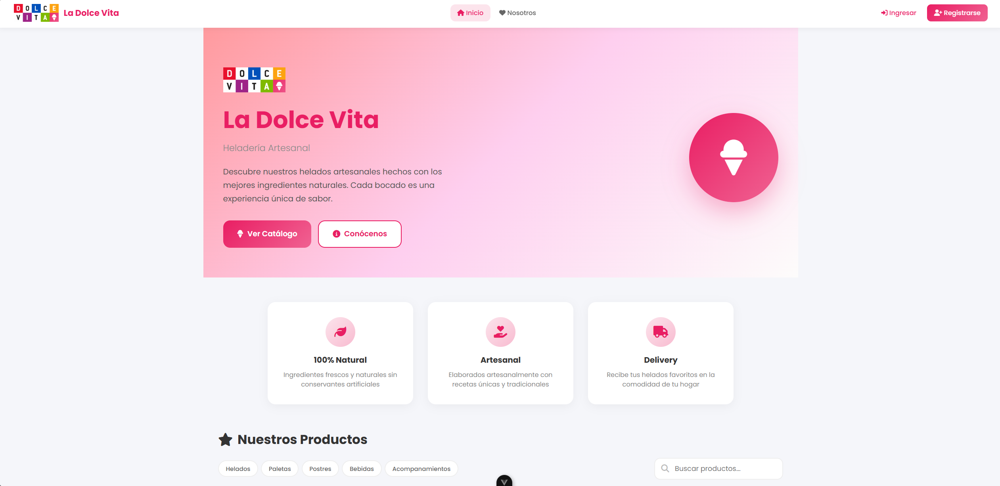 | 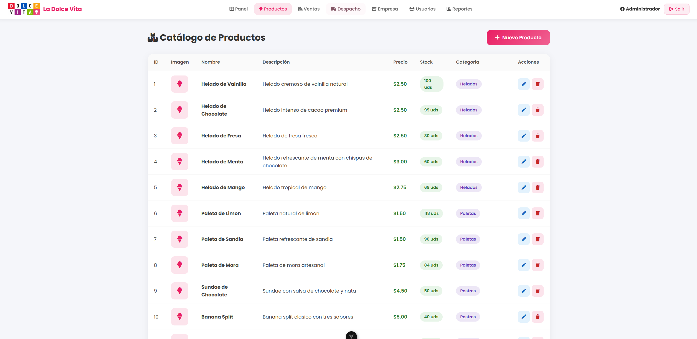 | 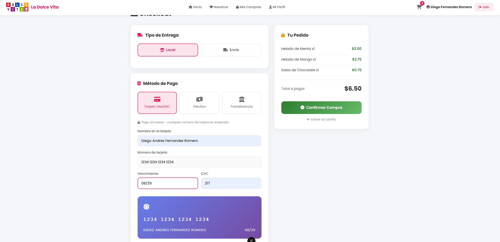 |

| Registro | Inicio de sesion | Sobre nosotros |
|:--------:|:----------------:|:--------------:|
| 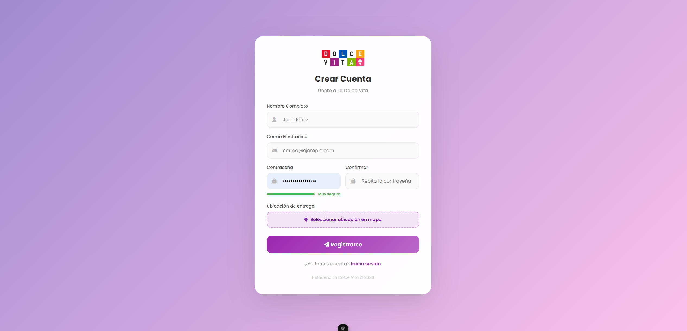 | 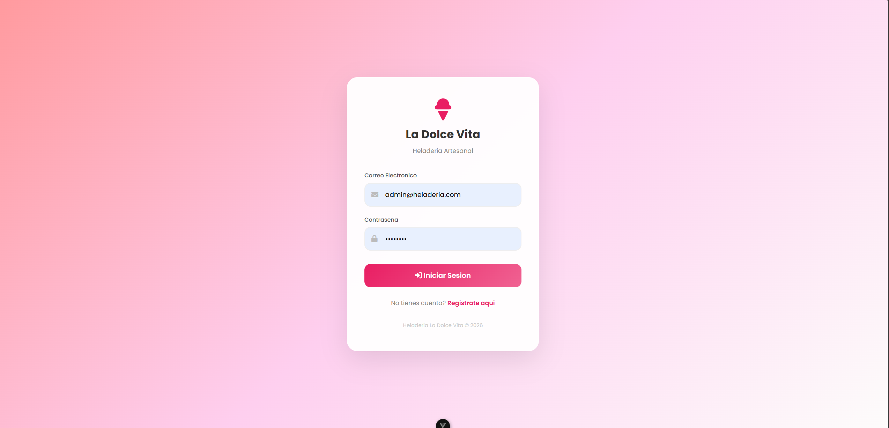 | 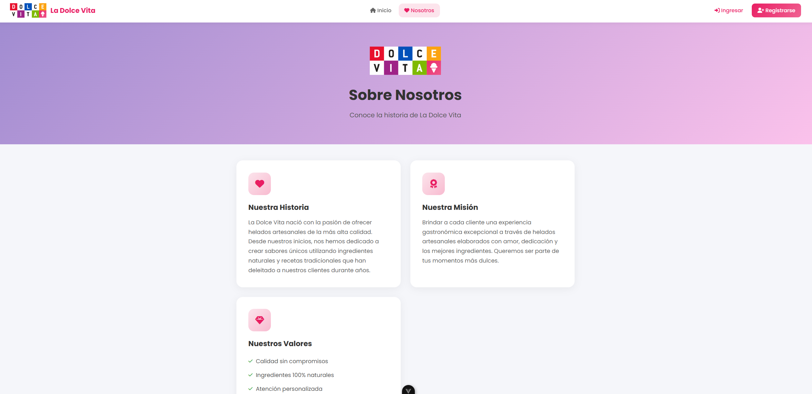 |

| Procesar compra | Compra exitosa | Mis compras |
|:---------------:|:--------------:|:-----------:|
|  | 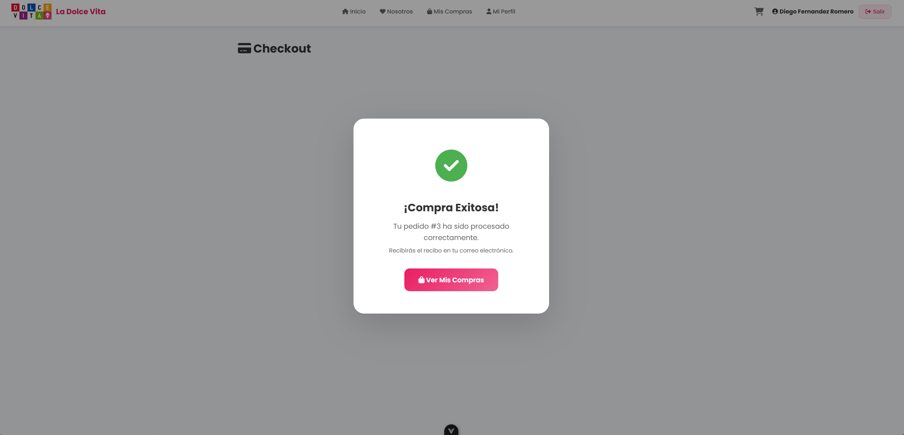 | 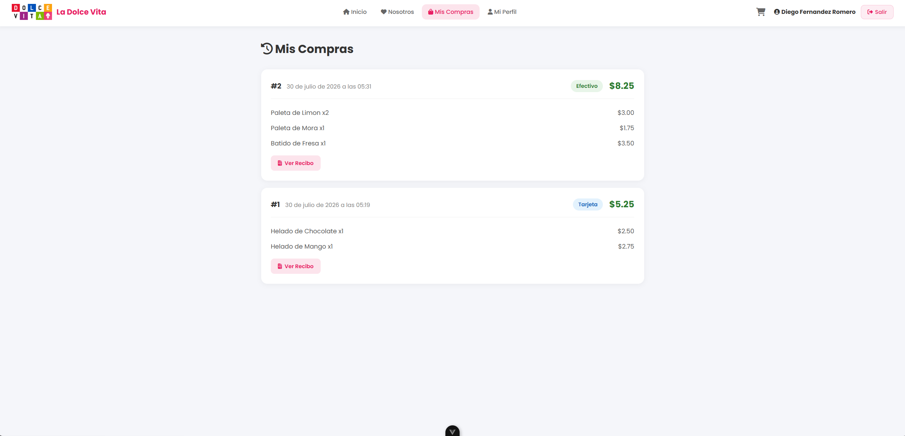 |

| Correo verificacion | Correo compra | Exito verificacion |
|:-------------------:|:-------------:|:------------------:|
| 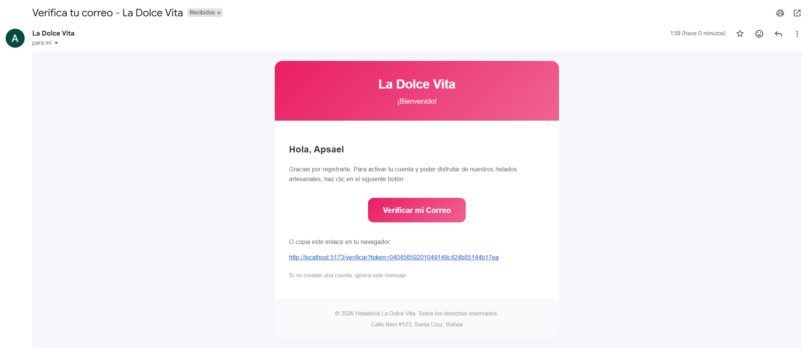 | 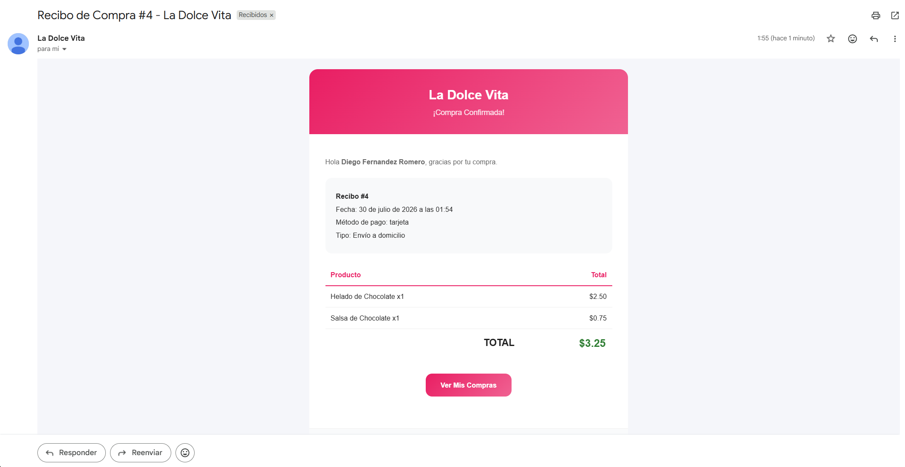 | 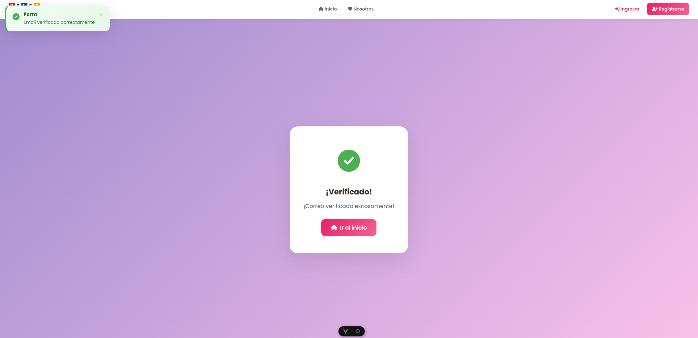 |

| Dashboard admin | Panel de despacho |
|:--------------:|:-----------------:|
| 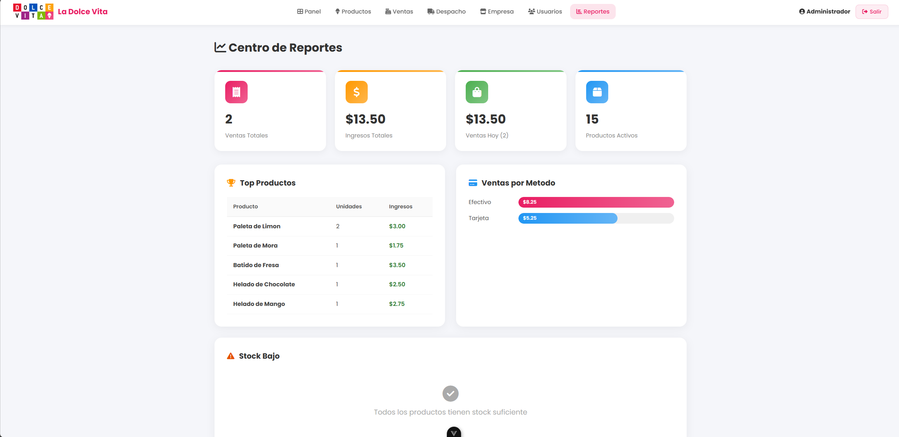 | 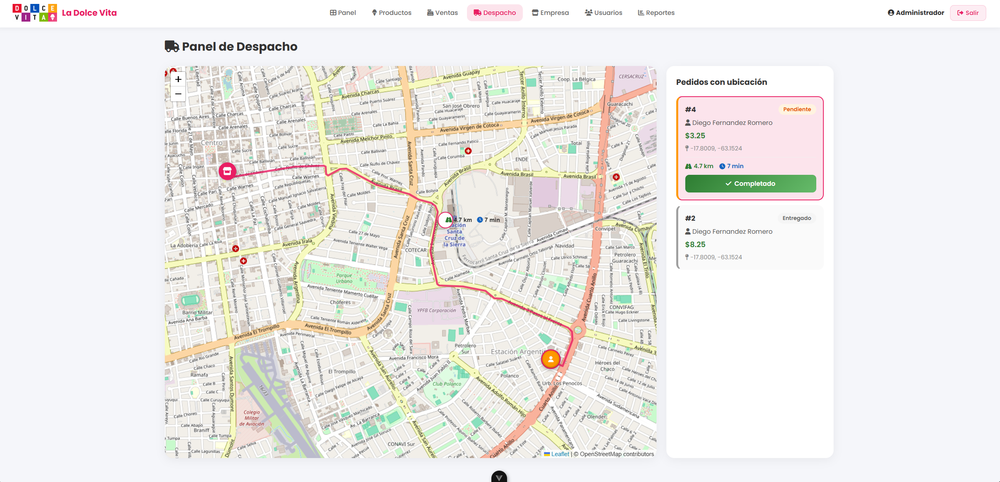 |

---

## Funcionalidades

### Publico (sin sesion)
- **Vitrina de productos** con busqueda por nombre, imagenes de producto
- **Pagina "Nosotros"** con informacion de la heladeria
- Navegacion libre por el catalogo

### Cliente (sesion iniciada)
- **Carrito de compras** con cantidad, subtotal y total
- **Checkout** con formulario de tarjeta (datos simulados), loader animado de 2 segundos
- **Seleccion de entrega**: Recoger en tienda o envio a domicilio con mapa Leaflet
- **Recibo profesional** modal con detalle, descarga PDF via impresion
- **Correo de confirmacion** enviado automaticamente tras cada compra via MailKit (Gmail SMTP)
- **Historial de compras** con recibo detallado y boton de impresion
- **Perfil** para actualizar nombre, correo, contrasena con indicador de fortaleza y ubicacion en mapa Leaflet
- **Verificacion de email** token enviado al correo, recordatorio en login si no verificado, reenvio con envio de correo

### Administrador
- **Panel de control** con acceso rapido a todas las secciones
- **Gestion de productos**: CRUD completo con campo de URL de imagen y thumbnails
- **Gestion de usuarios**: crear, editar roles, toggle directo activar/desactivar
- **Panel de despacho**: mapa Leaflet con marcadores de clientes, rutas OSRM con distancia y tiempo estimado, boton "Completado" para finalizar entrega
- **Configuracion de empresa**: marcador draggeable en mapa Leaflet para establecer ubicacion de la heladeria
- **Historial de ventas**: ver todas las ventas del sistema, eliminar con restauracion de stock
- **Reportes**: estadisticas, top productos, ventas por metodo de pago, alertas de stock bajo

### Seguridad
- Autenticacion **JWT** (tokens con expiracion de 8 horas)
- Contrasenas hasheadas con **BCrypt**
- Contrasena segura: minimo 8 caracteres, mayuscula, minuscula, digito y caracter especial
- Autorizacion por roles (admin/cliente)
- **CORS** configurado solo para el frontend
- Notificaciones **flotantes** (toast) en el lado izquierdo de la pantalla con animacion slide-in

---

## Credenciales iniciales

| Campo      | Valor                 |
|------------|-----------------------|
| Correo     | `admin@heladeria.com` |
| Contrasena | `admin123`            |

> Cambia la contrasena despues del primer inicio de sesion desde "Mi Perfil".

---

## Estructura del proyecto

```
proyecto-vue/
├── BackendApi/                          # Backend ASP.NET Core 10.0
│   ├── Controllers/
│   │   ├── AuthController.cs            # Login, registro, verificacion email, ubicacion
│   │   ├── ProductosController.cs       # CRUD productos (publico + admin)
│   │   ├── CategoriasController.cs      # CRUD categorias
│   │   ├── UsuariosController.cs        # Gestion de usuarios (admin)
│   │   ├── VentasController.cs          # Ventas, historial, cambio de estado
│   │   ├── MailController.cs            # Envio de correos via MailKit SMTP
│   │   └── ConfigController.cs          # Configuracion de la empresa (lat/lng)
│   ├── Services/
│   │   └── EmailService.cs              # Servicio de correo con MailKit
│   ├── Data/
│   │   ├── ApplicationDbContext.cs      # DbContext y configuracion EF Core
│   │   └── SeedData.cs                  # Seeding de admin, categorias y productos
│   ├── Models/
│   │   ├── Usuario.cs                   # Verificado, TokenVerificacion, Latitud, Longitud
│   │   ├── Categoria.cs
│   │   ├── Producto.cs                  # ImagenUrl
│   │   ├── Venta.cs                     # Estado, DireccionEnvio, LatitudEntrega, LongitudEntrega
│   │   ├── DetalleVenta.cs
│   │   └── Dtos/
│   │       ├── AuthDtos.cs              # Login, Register, Profile, Password, UpdateLocation
│   │       ├── ProductoDtos.cs
│   │       └── VentaDtos.cs             # VentaResponse con Estado
│   ├── BackendApi.csproj
│   ├── Program.cs                       # DI, JWT, CORS, EmailService, seeder
│   ├── appsettings.json                 # Connection string, JWT, SMTP, Empresa
│   └── script.sql
│
├── mockups/                             # Capturas de pantalla del sistema
│   ├── inicio.png
│   ├── productos.png
│   ├── carrito.png
│   ├── registro.png
│   ├── inicio-sesion.png
│   ├── sobre-nosotros.png
│   ├── procesar-compra.png
│   ├── compra-existosa.png
│   ├── mis-compras.png
│   ├── correo-verificacion.png
│   ├── correo-compra.png
│   ├── exito-verificacion.png
│   ├── dashboard.png
│   └── panel-despacho.png
│
├── src/                                 # Frontend Vue 3
│   ├── assets/
│   │   └── main.css                     # Estilos globales, animaciones, responsive
│   ├── components/
│   │   ├── Modal.vue                    # Modal reutilizable
│   │   ├── Toast.vue                    # Notificaciones flotantes (izquierda)
│   │   └── TopBar.vue                   # Barra de navegacion con logo
│   ├── composables/
│   │   ├── useStore.ts                  # Estado central + llamadas API
│   │   └── useToast.ts                  # Sistema de notificaciones toast
│   ├── router/
│   │   └── index.ts                     # Rutas con guard de auth y roles
│   ├── services/
│   │   └── api.ts                       # Cliente HTTP para backend C# (tipo seguro)
│   ├── views/
│   │   ├── HomeView.vue                 # Vitrina con busqueda e imagenes
│   │   ├── AboutView.vue                # Informacion + WhatsApp link
│   │   ├── LoginView.vue                # Login con recordatorio de verificacion
│   │   ├── RegisterView.vue             # Registro con mapa Leaflet + fortaleza password
│   │   ├── VerificarView.vue            # Pagina de verificacion de email
│   │   ├── CarritoView.vue              # Carrito con thumbnails
│   │   ├── CheckoutView.vue             # Pago, loader animado, mapa, correo recibo
│   │   ├── MisComprasView.vue           # Historial con recibo profesional y PDF
│   │   ├── MiPerfilView.vue             # Perfil con contrasena y ubicacion
│   │   ├── AdminDashboardView.vue       # Panel de control admin
│   │   ├── AdminProductosView.vue       # CRUD productos con campo imagen
│   │   ├── AdminUsuariosView.vue        # Gestion de usuarios con toggle
│   │   ├── AdminVentasView.vue          # Historial de ventas
│   │   ├── AdminDespachoView.vue        # Mapa Leaflet + OSRM + completar entrega
│   │   ├── AdminEmpresaView.vue         # Marcador empresa en mapa Leaflet
│   │   └── AdminReportesView.vue        # Reportes y estadisticas
│   ├── App.vue                          # Componente raiz
│   └── main.ts                          # Punto de entrada + leaflet CSS
│
├── public/
│   └── logo.png
├── index.html
├── package.json
├── tsconfig.json
├── vite.config.ts
└── README.md
```

---

## Rutas

| Ruta                  | Descripcion                     | Auth    | Rol     |
|-----------------------|---------------------------------|---------|---------|
| `/`                   | Vitrina de productos (inicio)   | No      | -       |
| `/about`              | Nosotros + WhatsApp             | No      | -       |
| `/login`              | Inicio de sesion                | No      | -       |
| `/register`           | Registro de cliente             | No      | -       |
| `/verificar`          | Verificacion de email           | No      | -       |
| `/carrito`            | Carrito de compras              | Si      | Cualquiera |
| `/checkout`           | Pago y confirmacion             | Si      | Cualquiera |
| `/mis-compras`        | Historial de compras            | Si      | Cualquiera |
| `/mi-perfil`          | Editar perfil                   | Si      | Cualquiera |
| `/admin/dashboard`    | Panel de control                | Si      | admin   |
| `/admin/productos`    | CRUD productos                  | Si      | admin   |
| `/admin/usuarios`     | Gestion de usuarios             | Si      | admin   |
| `/admin/ventas`       | Historial de ventas             | Si      | admin   |
| `/admin/despacho`     | Mapa de despacho con rutas      | Si      | admin   |
| `/admin/empresa`      | Configurar ubicacion empresa    | Si      | admin   |
| `/admin/reportes`     | Reportes y estadisticas         | Si      | admin   |

---

## Stack tecnologico

### Frontend
- **Vue 3.5** (Composition API + `<script setup>`)
- **TypeScript**
- **Vite 8**
- **Vue Router 4**
- **Leaflet** (mapas interactivos + OSRM routing)
- CSS puro con gradientes y diseno responsive
- Font Awesome 6 (iconos)
- Poppins (Google Fonts)
- Transiciones CSS con `TransitionGroup`

### Backend (C#)
- **ASP.NET Core 10.0** (Web API)
- **Entity Framework Core 10.0** (ORM)
- **SQL Server** (base de datos)
- **JWT Bearer** (autenticacion)
- **BCrypt.Net** (hashing de contrasenas)
- **MailKit** (envio de correos SMTP via Gmail)

---

## API Endpoints

### Auth
| Metodo | Ruta                          | Descripcion                  | Auth  |
|--------|-------------------------------|------------------------------|-------|
| POST   | `/api/auth/register`          | Registro de cliente          | No    |
| POST   | `/api/auth/login`             | Inicio de sesion             | No    |
| POST   | `/api/auth/verificar`         | Verificar email con token    | No    |
| POST   | `/api/auth/reenviar-verificacion` | Reenviar token verificacion | No    |
| GET    | `/api/auth/me`                | Usuario actual               | Si    |
| PUT    | `/api/auth/perfil`            | Actualizar perfil            | Si    |
| PUT    | `/api/auth/password`          | Cambiar contrasena           | Si    |
| PUT    | `/api/auth/ubicacion`         | Actualizar ubicacion         | Si    |

### Productos
| Metodo | Ruta                          | Descripcion               | Auth  |
|--------|-------------------------------|---------------------------|-------|
| GET    | `/api/productos`              | Productos activos         | No    |
| GET    | `/api/productos/all`          | Todos los productos       | Admin |
| GET    | `/api/productos/{id}`         | Producto por ID           | No    |
| GET    | `/api/productos/buscar?q=`    | Buscar por nombre         | No    |
| POST   | `/api/productos`              | Crear producto            | Admin |
| PUT    | `/api/productos/{id}`         | Actualizar producto       | Admin |
| DELETE | `/api/productos/{id}`         | Desactivar producto       | Admin |

### Categorias
| Metodo | Ruta                  | Descripcion            | Auth  |
|--------|-----------------------|------------------------|-------|
| GET    | `/api/categorias`     | Listar categorias      | No    |
| POST   | `/api/categorias`     | Crear categoria        | Admin |
| PUT    | `/api/categorias/{id}`| Actualizar categoria   | Admin |
| DELETE | `/api/categorias/{id}`| Eliminar categoria     | Admin |

### Usuarios (admin)
| Metodo | Ruta                  | Descripcion            | Auth  |
|--------|-----------------------|------------------------|-------|
| GET    | `/api/usuarios`       | Listar usuarios        | Admin |
| POST   | `/api/usuarios`       | Crear usuario          | Admin |
| PUT    | `/api/usuarios/{id}`  | Actualizar usuario     | Admin |
| DELETE | `/api/usuarios/{id}`  | Desactivar usuario     | Admin |

### Ventas
| Metodo | Ruta                      | Descripcion                   | Auth  |
|--------|---------------------------|-------------------------------|-------|
| POST   | `/api/ventas`             | Crear venta (checkout)        | Si    |
| GET    | `/api/ventas`             | Todas las ventas              | Admin |
| GET    | `/api/ventas/mis-compras` | Compras del usuario actual    | Si    |
| GET    | `/api/ventas/{id}`        | Detalle de venta              | Si    |
| PATCH  | `/api/ventas/{id}/estado` | Actualizar estado de venta    | Admin |
| DELETE | `/api/ventas/{id}`        | Eliminar venta + restaurar stock | Admin |

### Mail
| Metodo | Ruta                  | Descripcion                  | Auth  |
|--------|-----------------------|------------------------------|-------|
| POST   | `/api/mail/send`      | Enviar correo SMTP           | No    |

### Config
| Metodo | Ruta                  | Descripcion                  | Auth  |
|--------|-----------------------|------------------------------|-------|
| GET    | `/api/config/empresa` | Obtener configuracion        | No    |
| PUT    | `/api/config/empresa` | Actualizar latitud/longitud  | Admin |

---

## Como levantar el proyecto

### Requisitos previos
- [.NET 10.0 SDK](https://dotnet.microsoft.com/download/dotnet/10.0)
- [Node.js 22+](https://nodejs.org/)
- [SQL Server](https://www.microsoft.com/es-es/sql-server/sql-server-downloads)

### Paso 1: Base de datos

Al ejecutar el backend por primera vez, `EnsureCreatedAsync()` crea la base de datos automaticamente con el esquema actual y datos semilla (admin, categorias, productos).

Si prefieres crearla manualmente, ejecuta `BackendApi/script.sql` en SQL Server Management Studio.

### Paso 2: Configurar conexion

Edita `BackendApi/appsettings.json` con tu cadena de conexion:

```json
{
  "ConnectionStrings": {
    "DefaultConnection": "Server=.;Database=HeladeriaDb;Trusted_Connection=True;TrustServerCertificate=True;MultipleActiveResultSets=True"
  }
}
```

### Paso 3: Ejecutar backend

```sh
cd BackendApi
dotnet restore
dotnet run
```

API disponible en: `http://localhost:5057`

### Paso 4: Ejecutar frontend

```sh
npm install
npm run dev
```

Frontend disponible en: `http://localhost:5173`

### Paso 5: Usar la aplicacion

1. Abre `http://localhost:5173`
2. Explora productos en la pagina de inicio
3. Inicia sesion con `admin@heladeria.com` / `admin123` o crea una cuenta
4. Como admin accede al panel de control, gestion de productos, usuarios, despacho
5. Como cliente agrega productos al carrito y realiza una compra

### Configuracion de correo (SMTP Gmail)

El backend usa MailKit con Gmail SMTP. Las credenciales estan en `appsettings.json`:

```json
"Smtp": {
  "Host": "smtp.gmail.com",
  "Port": 587,
  "User": "tu-correo@gmail.com",
  "Pass": "tu-app-password",
  "FromEmail": "tu-correo@gmail.com",
  "FromName": "La Dolce Vita"
}
```

Para Gmail necesitas una [contraseña de aplicacion](https://support.google.com/accounts/answer/185833).

---

## Notas

- Las contrasenas se almacenan hasheadas con BCrypt.
- Los tokens JWT expiran en 8 horas (configurable en `appsettings.json`).
- El carrito se persiste en `localStorage`.
- Las ventas incluyen historial completo, detalle de productos y ubicacion de entrega.
- El stock se actualiza automaticamente al realizar una venta y se restaura al eliminarla.
- Los mapas Leaflet cargan tiles de OpenStreetMap via CDN.
- La verificacion de email usa un token unico almacenado en la base de datos.
- El estado de cada venta (`pendiente`, `confirmado`, `despachado`, `entregado`, `cancelado`) se gestiona desde el panel de despacho.

---

*Proyecto realizado por el grupo 404*
